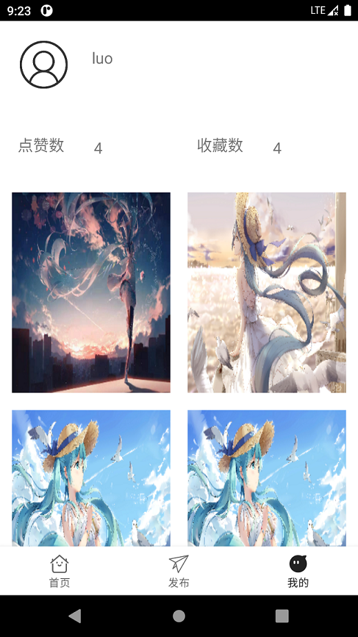

# android-pictureshare-soft
android课设:图片分享软件。
## 功能
1. 图片的点赞、收藏、下载
2. 图片发布
3. 个人主页
4. 个人收藏图片
## 项目介绍
1. ImagePicker:图片选择器
2. NineGridView:九宫格图片展示器
3. DataBase:数据库文件
4. backProgram：后端项目
5. 其他文件：android文件
## 食用方法
1. 不用账号登陆：在LoginActivity.java文件注释掉 login_in.setOnClickListener函数相应的部分
2. 修改自己的服务器IP：api包下面的constants类修改
3. 不能登陆、没有图片：服务器到期了
4. 图片上传的位置为服务器的/sourcepic目录
## android前端
1. android模板：Bottom Navigation Views Activity
2. android库：
   1. android网络请求库：okhttp3
   2. 第三方库：android九宫格图片展示器,网址：[NineGridView](https://github.com/LwkCoder/NineGridView)
   3. 第三方库：android自定义图片选择器,网址：[ImagePicker](https://github.com/LwkCoder/ImagePicker)
   4. 智能刷新框架：SmartRefreshLayout
3. android项目包介绍
   1. dialog:弹窗
   2. adapter:图片显示界面的适配器、收藏显示界面的适配器
   3. api:后端接口信息
   4. imageload:九宫格加载图片
   5. navigation.ui:Bottom Navigation Views Activity模板
   6. pickerload:从手机选择图片
   7. picture:图片实体类、收藏图片实体类
   8. toast:消息提示
   9. users:用户信息实体
4. android的activity介绍
   1. loginActivity:登陆界面
   2. MainActivity:主界面
   3. Sign_up:注册界面
   4. dashboard:发布界面
   5. home:首页界面
   6. notification:我的界面
## android后端
1. 项目框架：springboot
2. 服务器：阿里云
3. 数据库：mysql8.0.24
  1. 数据库关系图
5. 图片存储：在服务器上面，没有用OSS对象存储，路径为：/sourcepic（原图）、/thhpic(缩略图)（根目录）
## app效果展示
1. 主界面 
2. 发布界面 
3. 个人界面 
4. 登陆界面 
5. 注册界面 
